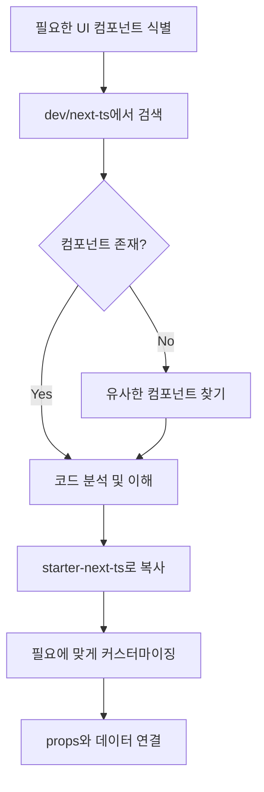

# 🚀 LunaJob 프로젝트 개발 지침서

## 📋 프로젝트 개요

**LunaJob**은 레거시 LadyAlba.co.kr 구인구직 포털을 최신 기술 스택으로 리뉴얼하는 프로젝트입니다.

### 핵심 원칙
- ⚠️ **절대 임의로 UI를 만들지 마세요**
- ✅ **반드시 템플릿 내 기존 컴포넌트를 사용하세요**
- 📦 **dev/next-ts의 완성된 샘플을 참고하세요**
- 🔧 **starter-next-ts에서 실제 개발을 진행하세요**

## 🏗️ 프로젝트 구조

```
/Users/deneb/Desktop/Project/LunaJob/
├── dev/next-ts/           # ⭐ 완성된 참고 템플릿 (Minimal v7.4.0)
├── starter-next-ts/       # 🔨 실제 작업 디렉토리
└── lunadocs/             # 📚 프로젝트 문서
    ├── 1-database-design.md
    ├── 2-ui-ux-design.md
    ├── 3-system-architecture.md
    ├── 4-api-specification.md
    └── 5-project-summary.md
```

## 🛠️ 기술 스택

| 레이어 | 기술 | 버전 |
|--------|------|------|
| Framework | Next.js | 20+ (Latest) |
| Language | TypeScript | 5.x |
| UI Library | Material-UI (MUI) | 6.x |
| Template | Minimal | v7.4.0 |
| Backend | Supabase | Latest |
| Database | PostgreSQL | via Supabase |
| Auth | Supabase Auth | Built-in |
| Storage | Supabase Storage | Built-in |
| Real-time | Supabase Realtime | Built-in |

## 📐 개발 규칙

### 1. UI 컴포넌트 사용 규칙

#### ❌ 하지 말아야 할 것
```typescript
// ❌ 잘못된 예시 - 직접 UI 컴포넌트 생성
const CustomButton = styled('button')({
  // 커스텀 스타일링...
});

// ❌ 잘못된 예시 - 외부 UI 라이브러리 사용
import { Button } from 'antd';
```

#### ✅ 올바른 방법
```typescript
// ✅ 올바른 예시 - dev/next-ts에서 컴포넌트 참고
// 1단계: dev/next-ts에서 유사한 컴포넌트 찾기
// 2단계: 해당 컴포넌트 코드 복사
// 3단계: starter-next-ts에 적용

// dev/next-ts/src/components에서 가져온 컴포넌트 사용
import { Button } from '@/components/button';
import { Card } from '@/components/card';
import { DataGrid } from '@/components/data-grid';
```

### 2. 컴포넌트 참조 워크플로우



### 3. 디렉토리 구조 규칙

```typescript
starter-next-ts/src/
├── app/                  # Next.js 20+ App Router
│   ├── (auth)/          # 인증 관련 페이지
│   ├── (dashboard)/     # 대시보드 레이아웃
│   ├── jobs/            # 채용공고 페이지
│   ├── resumes/         # 이력서 페이지
│   └── api/             # API 라우트
├── components/          # 재사용 가능한 컴포넌트
│   ├── cards/          # 카드 컴포넌트
│   ├── forms/          # 폼 컴포넌트
│   ├── tables/         # 테이블 컴포넌트
│   └── common/         # 공통 컴포넌트
├── sections/           # 페이지별 섹션
│   ├── home/          # 홈페이지 섹션
│   ├── job/           # 채용공고 섹션
│   └── resume/        # 이력서 섹션
├── layouts/           # 레이아웃 컴포넌트
├── theme/             # MUI 테마 설정
├── auth/              # 인증 관련 로직
├── lib/               # 외부 라이브러리 설정
│   └── supabase/      # Supabase 클라이언트
└── utils/             # 유틸리티 함수
```

## 🎨 UI/UX 구현 가이드

### 주요 페이지 매핑

| 레거시 페이지 | 새 라우트 | 사용할 템플릿 섹션 |
|--------------|----------|-------------------|
| index.php | / | dev/next-ts/src/sections/home |
| guin_list.php | /jobs | dev/next-ts/src/sections/job/list |
| guin_detail.php | /jobs/[id] | dev/next-ts/src/sections/job/details |
| document.php | /resumes | dev/next-ts/src/sections/resume |
| login.php | /auth/signin | dev/next-ts/src/sections/auth/sign-in |
| register.php | /auth/signup | dev/next-ts/src/sections/auth/sign-up |

### 컴포넌트 사용 예시

#### 채용공고 카드
```typescript
// ❌ 잘못된 방법
const JobCard = () => (
  <div className="job-card">
    {/* 직접 만든 카드 */}
  </div>
);

// ✅ 올바른 방법
// 1. dev/next-ts/src/sections/job/components/job-card.tsx 확인
// 2. 해당 컴포넌트 구조 분석
// 3. starter-next-ts에 적용
import { Card, CardContent, Stack, Typography, Chip } from '@mui/material';
import { JobCardProps } from '@/types/job';

const JobCard = ({ job }: JobCardProps) => (
  <Card>
    <CardContent>
      <Stack spacing={2}>
        <Typography variant="h6">{job.title}</Typography>
        <Typography variant="body2">{job.company}</Typography>
        <Stack direction="row" spacing={1}>
          <Chip label={job.location} size="small" />
          <Chip label={job.salary} size="small" />
        </Stack>
      </Stack>
    </CardContent>
  </Card>
);
```

## 🗄️ Supabase 연동

### 1. 환경 설정
```env
# .env.local
NEXT_PUBLIC_SUPABASE_URL=your-project-url
NEXT_PUBLIC_SUPABASE_ANON_KEY=your-anon-key
SUPABASE_SERVICE_ROLE_KEY=your-service-key
```

### 2. 클라이언트 설정
```typescript
// src/lib/supabase/client.ts
import { createBrowserClient } from '@supabase/ssr';

export const supabase = createBrowserClient(
  process.env.NEXT_PUBLIC_SUPABASE_URL!,
  process.env.NEXT_PUBLIC_SUPABASE_ANON_KEY!
);
```

### 3. 데이터베이스 테이블 구조

```sql
-- 주요 테이블
- profiles (사용자 프로필)
- companies (기업 정보)
- job_postings (채용공고)
- resumes (이력서)
- applications (지원 내역)
- bookmarks (북마크)
- notifications (알림)
```

## 🔄 개발 워크플로우

### 1. 기능 개발 프로세스

```bash
# 1. dev/next-ts에서 참고할 컴포넌트 찾기
cd dev/next-ts
grep -r "ComponentName" src/

# 2. starter-next-ts로 이동
cd ../../starter-next-ts

# 3. 개발 서버 실행
npm run dev

# 4. 컴포넌트 구현
# - dev/next-ts의 코드를 참고
# - 필요한 부분만 커스터마이징

# 5. Supabase 연동
# - 데이터 fetching
# - 실시간 구독
# - RLS 정책 적용
```

### 2. 컴포넌트 체크리스트

- [ ] dev/next-ts에서 유사 컴포넌트 확인
- [ ] MUI 컴포넌트 사용 여부 확인
- [ ] Minimal 템플릿 스타일 가이드 준수
- [ ] TypeScript 타입 정의
- [ ] Supabase 데이터 연동
- [ ] 반응형 디자인 적용
- [ ] 접근성 고려

## 📊 주요 기능 구현 가이드

### 1. 채용공고 목록
```typescript
// app/jobs/page.tsx
import { JobListView } from '@/sections/job/view';

// dev/next-ts/src/sections/job/view/job-list-view.tsx 참고
export default function JobsPage() {
  return <JobListView />;
}
```

### 2. 이력서 빌더
```typescript
// app/resumes/new/page.tsx
import { ResumeCreateView } from '@/sections/resume/view';

// dev/next-ts/src/sections/resume 참고
export default function ResumeCreatePage() {
  return <ResumeCreateView />;
}
```

### 3. 대시보드
```typescript
// app/(dashboard)/dashboard/page.tsx
import { DashboardView } from '@/sections/dashboard/view';

// dev/next-ts/src/sections/overview 참고
export default function DashboardPage() {
  return <DashboardView />;
}
```

## ⚠️ 주의사항

### 절대 하지 말아야 할 것들

1. **임의로 UI 컴포넌트 생성 금지**
   - 항상 dev/next-ts 참고
   - 없으면 유사한 것 찾아서 수정

2. **외부 UI 라이브러리 추가 금지**
   - MUI와 Minimal 템플릿만 사용
   - 추가 패키지 설치 전 확인 필수

3. **레거시 코드 그대로 포팅 금지**
   - 현대적 React 패턴 사용
   - Hooks, Context API 활용

4. **하드코딩된 데이터 사용 금지**
   - 모든 데이터는 Supabase에서
   - 환경변수로 설정값 관리

## 🚦 품질 관리

### 코드 품질 체크
```bash
# Lint 검사
npm run lint

# 타입 체크
npm run type-check

# 빌드 테스트
npm run build
```

### 성능 목표
- Lighthouse 점수: 90+
- 첫 페이지 로드: < 2초
- API 응답: < 200ms
- 검색 결과: < 500ms

## 📚 참고 자료

### 필수 확인 경로
1. **UI 컴포넌트**: `dev/next-ts/src/components/`
2. **페이지 섹션**: `dev/next-ts/src/sections/`
3. **레이아웃**: `dev/next-ts/src/layouts/`
4. **테마 설정**: `dev/next-ts/src/theme/`
5. **유틸리티**: `dev/next-ts/src/utils/`

### 문서 위치
- **데이터베이스 설계**: `lunadocs/1-database-design.md`
- **UI/UX 가이드**: `lunadocs/2-ui-ux-design.md`
- **시스템 아키텍처**: `lunadocs/3-system-architecture.md`
- **API 명세**: `lunadocs/4-api-specification.md`
- **프로젝트 요약**: `lunadocs/5-project-summary.md`

## 🎯 체크포인트

개발 시작 전 확인사항:
- [ ] dev/next-ts 디렉토리 구조 파악 완료
- [ ] Minimal 템플릿 컴포넌트 목록 확인
- [ ] Supabase 프로젝트 설정 완료
- [ ] 환경변수 설정 완료
- [ ] lunadocs 문서 숙지 완료

---

**마지막 업데이트**: 2025-01-09
**버전**: 1.0.0
**작성자**: Claude Code Assistant

> 💡 **Golden Rule**: dev/next-ts를 성경처럼 참고하고, starter-next-ts에서 실제 구현하세요!