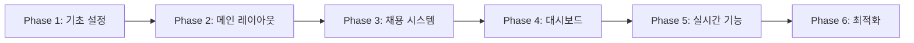

# 🚀 Luna Job 단계별 구현 로드맵

## 📋 전체 구현 개요



---

## 🎯 Phase 1: 기초 설정 및 인증 시스템 (3-4일)

### Day 1: Supabase 프로젝트 초기화
```bash
# 1. Supabase 프로젝트 설정
npm install @supabase/supabase-js @supabase/auth-ui-react @supabase/auth-ui-shared

# 2. 환경변수 설정 (.env.local)
NEXT_PUBLIC_SUPABASE_URL=your-project-url
NEXT_PUBLIC_SUPABASE_ANON_KEY=your-anon-key
SUPABASE_SERVICE_ROLE_KEY=your-service-key
```

**구현 파일:**
- `/src/lib/supabase/client.ts` - Supabase 클라이언트
- `/src/lib/supabase/server.ts` - 서버 사이드 클라이언트
- `/src/lib/supabase/middleware.ts` - 미들웨어 설정

### Day 2: Auth 서비스 및 스토어 구현
```typescript
// /src/services/auth.service.ts
export class AuthService {
  async signUp(email: string, password: string, userType: UserType)
  async signIn(email: string, password: string)
  async signOut()
  async resetPassword(email: string)
  async updateProfile(data: ProfileData)
}

// /src/store/auth.store.ts
interface AuthStore {
  user: User | null
  profile: UserProfile | null
  isLoading: boolean
  signIn: (email: string, password: string) => Promise<void>
  signOut: () => Promise<void>
}
```

### Day 3: 인증 페이지 구현
```
/src/app/(auth)/
├── layout.tsx              // Auth 레이아웃
├── login/page.tsx         // 로그인 페이지
├── register/page.tsx      // 회원가입 페이지
└── reset-password/page.tsx // 비밀번호 재설정

/src/sections/auth/
├── LoginForm.tsx          // 로그인 폼
├── RegisterForm.tsx       // 회원가입 폼 (구직자/구인자 선택)
└── ResetPasswordForm.tsx  // 비밀번호 재설정 폼
```

### Day 4: Protected Routes & Middleware
```typescript
// /src/middleware.ts
export function middleware(request: NextRequest) {
  // 인증 체크
  // 권한 체크 (user_type)
  // 리다이렉션 처리
}

// /src/hooks/useAuth.ts
export function useAuth() {
  // 인증 상태 관리
  // 프로필 정보 관리
  // 권한 체크
}
```

---

## 🏠 Phase 2: 메인 레이아웃 및 홈페이지 (3일)

### Day 5: 메인 레이아웃 구현
```
/src/layouts/main/
├── MainLayout.tsx         // 메인 레이아웃 컨테이너
├── Header.tsx            // 헤더 (네비게이션 포함)
├── Footer.tsx            // 푸터
└── nav/
    ├── NavDesktop.tsx    // 데스크톱 네비게이션
    ├── NavMobile.tsx     // 모바일 네비게이션
    └── NavConfig.tsx     // 네비게이션 설정
```

### Day 6: 홈페이지 섹션 구현
```
/src/sections/home/
├── HeroSection.tsx        // 히어로 섹션
├── JobSearchSection.tsx   // 검색 섹션
├── FeaturedJobs.tsx      // 추천 채용공고
├── PopularCategories.tsx // 인기 카테고리
├── TopCompanies.tsx      // 인기 업체
└── HowItWorks.tsx        // 서비스 소개
```

### Day 7: 공통 컴포넌트 구현
```
/src/components/
├── cards/
│   ├── JobCard.tsx       // 채용공고 카드
│   ├── CompanyCard.tsx   // 회사 카드
│   └── CategoryCard.tsx  // 카테고리 카드
├── search/
│   ├── SearchBar.tsx     // 검색바
│   ├── FilterPanel.tsx   // 필터 패널
│   └── LocationSearch.tsx // 위치 검색
└── common/
    ├── LoadingScreen.tsx  // 로딩 화면
    ├── EmptyContent.tsx   // 빈 콘텐츠
    └── ErrorBoundary.tsx  // 에러 바운더리
```

---

## 💼 Phase 3: 채용 시스템 구현 (5일)

### Day 8-9: 채용공고 목록 및 상세
```
/src/app/(main)/jobs/
├── page.tsx              // 채용공고 목록
├── [id]/page.tsx        // 채용공고 상세
└── search/page.tsx      // 검색 결과

/src/sections/job/
├── JobList.tsx          // 채용공고 목록
├── JobDetail.tsx        // 채용공고 상세
├── JobFilters.tsx       // 필터
├── JobApplication.tsx   // 지원하기
└── RelatedJobs.tsx      // 관련 채용공고
```

### Day 10: 채용 서비스 구현
```typescript
// /src/services/job.service.ts
export class JobService {
  async getJobs(filters: JobFilters, pagination: Pagination)
  async getJobById(id: string)
  async applyForJob(jobId: string, applicationData: ApplicationData)
  async bookmarkJob(jobId: string)
  async searchJobs(query: string, filters: JobFilters)
}

// /src/hooks/useJobs.ts
export function useJobs() {
  // 채용공고 목록
  // 필터링 & 정렬
  // 페이지네이션
  // 북마크 기능
}
```

### Day 11: 기업 정보 페이지
```
/src/app/(main)/companies/
├── page.tsx              // 기업 목록
└── [id]/page.tsx        // 기업 상세

/src/sections/company/
├── CompanyProfile.tsx    // 기업 프로필
├── CompanyJobs.tsx      // 기업 채용공고
├── CompanyReviews.tsx   // 기업 리뷰
└── CompanyGallery.tsx   // 기업 갤러리
```

### Day 12: 지원 시스템
```
/src/components/forms/
├── ApplicationForm.tsx   // 지원서 폼
├── ResumeUpload.tsx     // 이력서 업로드
└── CoverLetter.tsx      // 자기소개서

/src/sections/application/
├── ApplicationModal.tsx  // 지원 모달
├── QuickApply.tsx       // 간편 지원
└── ApplicationStatus.tsx // 지원 상태
```

---

## 📊 Phase 4: 대시보드 구현 (5일)

### Day 13-14: 구직자 대시보드
```
/src/app/(dashboard)/jobseeker/
├── page.tsx              // 대시보드 홈
├── profile/page.tsx      // 프로필 관리
├── applications/page.tsx // 지원 내역
├── bookmarks/page.tsx    // 북마크
├── resume/page.tsx       // 이력서 관리
└── settings/page.tsx     // 설정

/src/sections/dashboard/jobseeker/
├── DashboardOverview.tsx // 대시보드 개요
├── ApplicationList.tsx   // 지원 내역 목록
├── ProfileForm.tsx       // 프로필 수정 폼
└── ResumeBuilder.tsx     // 이력서 빌더
```

### Day 15-16: 구인자 대시보드
```
/src/app/(dashboard)/employer/
├── page.tsx              // 대시보드 홈
├── jobs/
│   ├── page.tsx         // 채용공고 관리
│   ├── create/page.tsx  // 채용공고 작성
│   └── [id]/edit/page.tsx // 채용공고 수정
├── applications/page.tsx // 지원자 관리
├── company/page.tsx      // 회사 정보 관리
└── subscription/page.tsx // 구독 관리

/src/sections/dashboard/employer/
├── JobPostForm.tsx       // 채용공고 작성 폼
├── ApplicantList.tsx     // 지원자 목록
├── ApplicantDetail.tsx   // 지원자 상세
└── CompanySettings.tsx   // 회사 설정
```

### Day 17: 대시보드 공통 컴포넌트
```
/src/layouts/dashboard/
├── DashboardLayout.tsx   // 대시보드 레이아웃
├── Sidebar.tsx          // 사이드바
├── DashboardNav.tsx     // 네비게이션
└── AccountPopover.tsx   // 계정 메뉴

/src/components/dashboard/
├── StatsCard.tsx        // 통계 카드
├── ActivityFeed.tsx     // 활동 피드
├── NotificationList.tsx // 알림 목록
└── QuickActions.tsx     // 빠른 작업
```

---

## 💬 Phase 5: 실시간 기능 (4일)

### Day 18: 채팅 시스템
```
/src/app/(dashboard)/messages/
├── page.tsx             // 메시지 목록
└── [roomId]/page.tsx    // 채팅방

/src/sections/chat/
├── ChatList.tsx         // 채팅 목록
├── ChatRoom.tsx         // 채팅방
├── MessageInput.tsx     // 메시지 입력
└── MessageList.tsx      // 메시지 목록

/src/hooks/useRealtime.ts
// Supabase Realtime 연동
```

### Day 19: 알림 시스템
```
/src/components/notifications/
├── NotificationPopover.tsx // 알림 팝오버
├── NotificationItem.tsx    // 알림 아이템
└── NotificationSettings.tsx // 알림 설정

/src/services/notification.service.ts
// 알림 서비스 구현
```

### Day 20: 리뷰 & 평점 시스템
```
/src/sections/review/
├── ReviewForm.tsx       // 리뷰 작성 폼
├── ReviewList.tsx       // 리뷰 목록
├── RatingDisplay.tsx    // 평점 표시
└── ReviewModal.tsx      // 리뷰 모달
```

### Day 21: 검색 최적화
```
/src/services/search.service.ts
// 전문 검색 구현
// 자동완성
// 검색 필터
// 검색 기록
```

---

## ⚡ Phase 6: 최적화 및 배포 (3일)

### Day 22: 성능 최적화
```typescript
// 구현 항목:
- 이미지 최적화 (next/image)
- 코드 스플리팅
- 레이지 로딩
- 캐싱 전략
- SEO 최적화
- 메타 태그 설정
```

### Day 23: 테스트 및 디버깅
```typescript
// 테스트 구현:
- Unit 테스트 (Jest)
- Integration 테스트
- E2E 테스트 (Playwright)
- 성능 테스트
```

### Day 24: 배포
```bash
# Vercel 배포
- 환경변수 설정
- 도메인 연결
- SSL 설정
- 모니터링 설정
- 에러 트래킹 (Sentry)
```

---

## 📁 파일 구조별 구현 우선순위

### 🔴 최우선 구현 (Week 1)
```
/src/
├── lib/supabase/         ✅ Supabase 설정
├── services/auth.service.ts ✅ 인증 서비스
├── store/auth.store.ts   ✅ 인증 스토어
├── app/(auth)/          ✅ 인증 페이지
└── middleware.ts        ✅ 미들웨어
```

### 🟡 핵심 기능 (Week 2-3)
```
/src/
├── layouts/main/        ✅ 메인 레이아웃
├── sections/home/       ✅ 홈 섹션
├── sections/job/        ✅ 채용 섹션
├── services/job.service.ts ✅ 채용 서비스
└── components/cards/    ✅ 카드 컴포넌트
```

### 🟢 대시보드 (Week 3-4)
```
/src/
├── layouts/dashboard/   ✅ 대시보드 레이아웃
├── app/(dashboard)/     ✅ 대시보드 페이지
├── sections/dashboard/  ✅ 대시보드 섹션
└── components/forms/    ✅ 폼 컴포넌트
```

### 🔵 고급 기능 (Week 4-5)
```
/src/
├── sections/chat/       ✅ 채팅 기능
├── hooks/useRealtime.ts ✅ 실시간 훅
├── components/notifications/ ✅ 알림
└── services/search.service.ts ✅ 검색
```

---

## 🎯 즉시 시작 가능한 작업

### 1️⃣ 지금 바로 시작 (30분 내)
```bash
# 1. Supabase 클라이언트 생성
touch src/lib/supabase/client.ts
touch src/lib/supabase/server.ts

# 2. Auth 서비스 생성
mkdir -p src/services
touch src/services/auth.service.ts

# 3. Auth 스토어 생성
mkdir -p src/store
touch src/store/auth.store.ts
```

### 2️⃣ 첫 번째 구현 파일
```typescript
// /src/lib/supabase/client.ts
import { createBrowserClient } from '@supabase/ssr'

export function createClient() {
  return createBrowserClient(
    process.env.NEXT_PUBLIC_SUPABASE_URL!,
    process.env.NEXT_PUBLIC_SUPABASE_ANON_KEY!
  )
}
```

### 3️⃣ 다음 단계 체크리스트
- [ ] Supabase 프로젝트 생성
- [ ] 환경변수 설정
- [ ] 데이터베이스 스키마 적용
- [ ] Auth 서비스 구현
- [ ] 로그인 페이지 구현
- [ ] 회원가입 페이지 구현
- [ ] Protected Route 설정

---

## 📊 진행 상황 추적

### Week 1: 기초 설정 ✅
- [ ] Supabase 설정
- [ ] 인증 시스템
- [ ] 기본 레이아웃

### Week 2: 메인 기능 🔄
- [ ] 홈페이지
- [ ] 채용공고 목록
- [ ] 채용공고 상세

### Week 3: 대시보드 ⏳
- [ ] 구직자 대시보드
- [ ] 구인자 대시보드
- [ ] 프로필 관리

### Week 4: 고급 기능 ⏳
- [ ] 실시간 채팅
- [ ] 알림 시스템
- [ ] 검색 최적화

### Week 5: 마무리 ⏳
- [ ] 성능 최적화
- [ ] 테스트
- [ ] 배포

---

## 💡 구현 팁

1. **Minimal 템플릿 활용**: `/luna/src/components/`의 기존 컴포넌트 최대한 활용
2. **타입 안정성**: TypeScript 타입 정의 먼저 작성
3. **점진적 구현**: MVP 먼저 구현 후 기능 추가
4. **테스트 주도**: 핵심 기능은 테스트 코드 작성
5. **문서화**: 구현하면서 문서 업데이트

---

## 🚨 주의사항

1. **Supabase Auth 활용**: 세션/패스워드 관리는 Supabase에 위임
2. **RLS 정책**: 모든 테이블에 Row Level Security 적용
3. **타입 정의**: Database 타입은 Supabase CLI로 자동 생성
4. **환경변수**: 절대 커밋하지 말 것
5. **익명 모드**: 특수 업종 특성상 프라이버시 기능 필수

이 로드맵을 따라 단계적으로 구현하면 Luna Job 프로젝트를 체계적으로 완성할 수 있습니다.