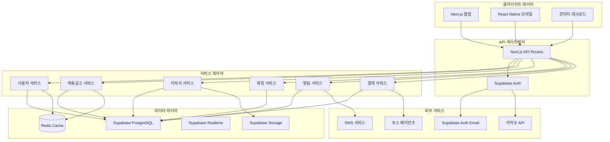

# 시스템 아키텍처 문서
## 현대적 구인구직 포털 플랫폼

## 1. 아키텍처 개요

### 1.1 고수준 아키텍처


### 1.2 기술 스택

#### 프론트엔드
- **프레임워크**: Next.js 15.4 with App Router
- **언어**: TypeScript 5.9
- **UI 라이브러리**: MUI v7 + Minimal 템플릿
- **상태 관리**: Zustand / Redux Toolkit
- **API 클라이언트**: Supabase JavaScript Client
- **폼**: React Hook Form + Zod
- **애니메이션**: Framer Motion
- **차트**: ApexCharts

#### 백엔드
- **데이터베이스**: Supabase PostgreSQL
- **인증**: Supabase Auth
- **스토리지**: Supabase Storage
- **실시간**: Supabase Realtime
- **런타임**: Node.js 20 LTS
- **프레임워크**: Next.js API Routes
- **검증**: Zod
- **캐시**: Redis
- **큐**: Bull (Redis 기반)

#### 인프라 & 개발 도구
- **컨테이너**: Docker
- **오케스트레이션**: Kubernetes / ECS
- **CI/CD**: GitHub Actions
- **모니터링**: Datadog / Sentry
- **호스팅**: Vercel / AWS

## 2. Supabase 통합 아키텍처

### 2.1 Supabase 클라이언트 설정
```typescript
// lib/supabase/client.ts
import { createClient } from '@supabase/supabase-js';
import { Database } from '@/types/database';

const supabaseUrl = process.env.NEXT_PUBLIC_SUPABASE_URL!;
const supabaseAnonKey = process.env.NEXT_PUBLIC_SUPABASE_ANON_KEY!;

export const supabase = createClient<Database>(supabaseUrl, supabaseAnonKey, {
  auth: {
    autoRefreshToken: true,
    persistSession: true,
    detectSessionInUrl: true,
    flowType: 'pkce'
  },
  realtime: {
    params: {
      eventsPerSecond: 10
    }
  }
});

// 서버 사이드 클라이언트
export const createServerClient = () => {
  return createClient<Database>(
    process.env.NEXT_PUBLIC_SUPABASE_URL!,
    process.env.SUPABASE_SERVICE_ROLE_KEY!,
    {
      auth: {
        autoRefreshToken: false,
        persistSession: false
      }
    }
  );
};
```

### 2.2 Supabase Auth 통합
```typescript
// lib/auth/supabase-auth.ts
export class SupabaseAuthService {
  async signUp(email: string, password: string, userData: any) {
    const { data, error } = await supabase.auth.signUp({
      email,
      password,
      options: {
        data: userData,
        emailRedirectTo: `${window.location.origin}/auth/callback`
      }
    });

    if (error) throw error;

    // Supabase에서 사용자가 생성되면 프로필 테이블에도 추가
    if (data.user) {
      await supabase.from('profiles').insert({
        id: data.user.id,
        email: data.user.email,
        name: userData.name,
        user_type: userData.userType,
        created_at: new Date().toISOString()
      });
    }

    return data;
  }

  async signIn(email: string, password: string) {
    const { data, error } = await supabase.auth.signInWithPassword({
      email,
      password
    });

    if (error) throw error;
    return data;
  }

  async signInWithKakao() {
    const { data, error } = await supabase.auth.signInWithOAuth({
      provider: 'kakao',
      options: {
        redirectTo: `${window.location.origin}/auth/callback`
      }
    });

    if (error) throw error;
    return data;
  }

  async signOut() {
    const { error } = await supabase.auth.signOut();
    if (error) throw error;
  }

  async resetPassword(email: string) {
    const { error } = await supabase.auth.resetPasswordForEmail(email, {
      redirectTo: `${window.location.origin}/auth/reset-password`
    });

    if (error) throw error;
  }

  async updatePassword(password: string) {
    const { error } = await supabase.auth.updateUser({
      password
    });

    if (error) throw error;
  }

  async getCurrentUser() {
    const { data: { user }, error } = await supabase.auth.getUser();
    if (error) throw error;
    return user;
  }

  onAuthStateChange(callback: (event: string, session: any) => void) {
    return supabase.auth.onAuthStateChange(callback);
  }
}
```

### 2.3 Supabase 데이터베이스 서비스
```typescript
// lib/database/supabase-db.ts
export class SupabaseService {
  
  // 채용공고 관리
  async createJobPosting(jobData: JobPostingInsert) {
    const { data, error } = await supabase
      .from('job_postings')
      .insert(jobData)
      .select('*')
      .single();

    if (error) throw error;
    return data;
  }

  async getJobPostings(filters: JobFilters) {
    let query = supabase
      .from('job_postings')
      .select(`
        *,
        companies(*),
        applications(count)
      `)
      .eq('status', 'ACTIVE');

    // 필터 적용
    if (filters.category) {
      query = query.eq('job_category', filters.category);
    }
    
    if (filters.location) {
      query = query.ilike('work_location', `%${filters.location}%`);
    }

    if (filters.search) {
      query = query.or(`title.ilike.%${filters.search}%,description.ilike.%${filters.search}%`);
    }

    if (filters.salaryMin) {
      query = query.gte('min_salary', filters.salaryMin);
    }

    // 정렬
    query = query.order(filters.sortBy || 'created_at', { 
      ascending: filters.sortOrder === 'asc' 
    });

    // 페이지네이션
    const from = (filters.page - 1) * filters.limit;
    const to = from + filters.limit - 1;
    query = query.range(from, to);

    const { data, error, count } = await query;
    if (error) throw error;

    return {
      data,
      total: count,
      totalPages: Math.ceil((count || 0) / filters.limit)
    };
  }

  async getJobById(id: string) {
    const { data, error } = await supabase
      .from('job_postings')
      .select(`
        *,
        companies(*),
        applications(
          id,
          user_id,
          status,
          created_at,
          users(name, email)
        )
      `)
      .eq('id', id)
      .single();

    if (error) throw error;
    return data;
  }

  // 이력서 관리
  async createResume(resumeData: ResumeInsert) {
    const { data, error } = await supabase
      .from('resumes')
      .insert(resumeData)
      .select('*')
      .single();

    if (error) throw error;
    return data;
  }

  async uploadResumeFile(file: File, userId: string) {
    const fileExt = file.name.split('.').pop();
    const fileName = `${userId}/${Date.now()}.${fileExt}`;

    const { data, error } = await supabase.storage
      .from('resumes')
      .upload(fileName, file);

    if (error) throw error;

    const { data: { publicUrl } } = supabase.storage
      .from('resumes')
      .getPublicUrl(fileName);

    return publicUrl;
  }

  // 지원 관리
  async applyToJob(applicationData: ApplicationInsert) {
    const { data, error } = await supabase
      .from('applications')
      .insert(applicationData)
      .select('*')
      .single();

    if (error) throw error;

    // 실시간 알림 전송
    await supabase
      .from('notifications')
      .insert({
        user_id: applicationData.employer_id,
        type: 'NEW_APPLICATION',
        title: '새로운 지원서가 도착했습니다',
        content: `${applicationData.applicant_name}님이 지원했습니다`,
        data: { applicationId: data.id }
      });

    return data;
  }

  // 실시간 구독
  subscribeToJobUpdates(callback: (payload: any) => void) {
    return supabase
      .channel('job_updates')
      .on('postgres_changes', {
        event: '*',
        schema: 'public',
        table: 'job_postings'
      }, callback)
      .subscribe();
  }

  subscribeToApplications(userId: string, callback: (payload: any) => void) {
    return supabase
      .channel('user_applications')
      .on('postgres_changes', {
        event: '*',
        schema: 'public',
        table: 'applications',
        filter: `user_id=eq.${userId}`
      }, callback)
      .subscribe();
  }
}
```

### 2.4 Supabase Row Level Security (RLS)
```sql
-- 사용자 프로필 보안 정책
CREATE POLICY "사용자는 자신의 프로필만 볼 수 있다" ON profiles
  FOR SELECT USING (auth.uid() = id);

CREATE POLICY "사용자는 자신의 프로필만 수정할 수 있다" ON profiles
  FOR UPDATE USING (auth.uid() = id);

-- 채용공고 보안 정책
CREATE POLICY "모든 사용자가 활성 채용공고를 볼 수 있다" ON job_postings
  FOR SELECT USING (status = 'ACTIVE');

CREATE POLICY "고용주만 채용공고를 생성할 수 있다" ON job_postings
  FOR INSERT WITH CHECK (
    auth.uid() = user_id AND 
    EXISTS (
      SELECT 1 FROM profiles 
      WHERE id = auth.uid() AND user_type = 'EMPLOYER'
    )
  );

CREATE POLICY "고용주는 자신의 채용공고만 수정할 수 있다" ON job_postings
  FOR UPDATE USING (auth.uid() = user_id);

-- 지원서 보안 정책
CREATE POLICY "사용자는 자신의 지원서만 볼 수 있다" ON applications
  FOR SELECT USING (
    auth.uid() = user_id OR 
    auth.uid() IN (
      SELECT user_id FROM job_postings WHERE id = job_posting_id
    )
  );

CREATE POLICY "구직자만 지원서를 제출할 수 있다" ON applications
  FOR INSERT WITH CHECK (
    auth.uid() = user_id AND
    EXISTS (
      SELECT 1 FROM profiles 
      WHERE id = auth.uid() AND user_type = 'JOB_SEEKER'
    )
  );

-- 이력서 보안 정책
CREATE POLICY "사용자는 자신의 이력서만 관리할 수 있다" ON resumes
  FOR ALL USING (auth.uid() = user_id);

CREATE POLICY "공개 이력서는 모든 사용자가 볼 수 있다" ON resumes
  FOR SELECT USING (is_public = true);
```

### 2.5 Supabase Edge Functions
```typescript
// supabase/functions/match-jobs/index.ts
import { createClient } from '@supabase/supabase-js';
import { corsHeaders } from '../_shared/cors.ts';

const supabase = createClient(
  Deno.env.get('SUPABASE_URL') ?? '',
  Deno.env.get('SUPABASE_SERVICE_ROLE_KEY') ?? ''
);

Deno.serve(async (req) => {
  if (req.method === 'OPTIONS') {
    return new Response('ok', { headers: corsHeaders });
  }

  try {
    const { userId } = await req.json();

    // 사용자 프로필 및 스킬 가져오기
    const { data: profile } = await supabase
      .from('profiles')
      .select('*, skills(*)')
      .eq('id', userId)
      .single();

    // AI 기반 매칭 로직
    const matchedJobs = await performJobMatching(profile);

    return new Response(
      JSON.stringify({ matchedJobs }),
      {
        headers: { ...corsHeaders, 'Content-Type': 'application/json' },
        status: 200,
      }
    );
  } catch (error) {
    return new Response(
      JSON.stringify({ error: error.message }),
      {
        headers: { ...corsHeaders, 'Content-Type': 'application/json' },
        status: 400,
      }
    );
  }
});

async function performJobMatching(profile: any) {
  // AI 매칭 알고리즘 구현
  // 스킬, 위치, 급여 등을 고려한 매칭
  return [];
}
```

## 3. 서비스 아키텍처

### 3.1 사용자 서비스 (Supabase 통합)
```typescript
// services/user/supabase-user.ts
export class UserService {
  private supabase = createClient();

  async registerUser(userData: RegisterData) {
    // Supabase Auth로 회원가입
    const { data: authData, error: authError } = await this.supabase.auth.signUp({
      email: userData.email,
      password: userData.password,
      options: {
        data: {
          name: userData.name,
          user_type: userData.userType
        }
      }
    });

    if (authError) throw authError;

    // 프로필 테이블에 추가 정보 저장
    if (authData.user) {
      const { error: profileError } = await this.supabase
        .from('profiles')
        .insert({
          id: authData.user.id,
          name: userData.name,
          user_type: userData.userType,
          phone: userData.phone
        });

      if (profileError) throw profileError;
    }

    return authData;
  }

  async getUserProfile(userId: string) {
    const { data, error } = await this.supabase
      .from('profiles')
      .select(`
        *,
        companies(*),
        resumes(*)
      `)
      .eq('id', userId)
      .single();

    if (error) throw error;
    return data;
  }

  async updateProfile(userId: string, profileData: ProfileUpdate) {
    const { data, error } = await this.supabase
      .from('profiles')
      .update(profileData)
      .eq('id', userId)
      .select('*')
      .single();

    if (error) throw error;
    return data;
  }

  async uploadAvatar(file: File, userId: string) {
    const fileExt = file.name.split('.').pop();
    const fileName = `avatars/${userId}.${fileExt}`;

    // Supabase Storage에 업로드
    const { data, error } = await this.supabase.storage
      .from('avatars')
      .upload(fileName, file, {
        cacheControl: '3600',
        upsert: true
      });

    if (error) throw error;

    // 공개 URL 생성
    const { data: { publicUrl } } = this.supabase.storage
      .from('avatars')
      .getPublicUrl(fileName);

    // 프로필에 아바타 URL 업데이트
    await this.supabase
      .from('profiles')
      .update({ avatar_url: publicUrl })
      .eq('id', userId);

    return publicUrl;
  }
}
```

### 3.2 실시간 서비스
```typescript
// services/realtime/supabase-realtime.ts
export class RealtimeService {
  private supabase = createClient();

  // 실시간 알림 구독
  subscribeToNotifications(userId: string, callback: (notification: any) => void) {
    return this.supabase
      .channel(`user_notifications_${userId}`)
      .on('postgres_changes', {
        event: 'INSERT',
        schema: 'public',
        table: 'notifications',
        filter: `user_id=eq.${userId}`
      }, (payload) => {
        callback(payload.new);
      })
      .subscribe();
  }

  // 채용공고 업데이트 구독
  subscribeToJobUpdates(callback: (job: any) => void) {
    return this.supabase
      .channel('job_updates')
      .on('postgres_changes', {
        event: '*',
        schema: 'public',
        table: 'job_postings'
      }, (payload) => {
        callback(payload);
      })
      .subscribe();
  }

  // 지원 상태 업데이트 구독
  subscribeToApplicationUpdates(userId: string, callback: (application: any) => void) {
    return this.supabase
      .channel(`user_applications_${userId}`)
      .on('postgres_changes', {
        event: 'UPDATE',
        schema: 'public',
        table: 'applications',
        filter: `user_id=eq.${userId}`
      }, (payload) => {
        callback(payload.new);
      })
      .subscribe();
  }

  // 실시간 채팅
  subscribeToMessages(conversationId: string, callback: (message: any) => void) {
    return this.supabase
      .channel(`conversation_${conversationId}`)
      .on('postgres_changes', {
        event: 'INSERT',
        schema: 'public',
        table: 'messages',
        filter: `conversation_id=eq.${conversationId}`
      }, (payload) => {
        callback(payload.new);
      })
      .subscribe();
  }

  async sendMessage(messageData: MessageInsert) {
    const { data, error } = await this.supabase
      .from('messages')
      .insert(messageData)
      .select('*')
      .single();

    if (error) throw error;
    return data;
  }
}
```

## 4. 보안 아키텍처

### 4.1 Supabase 보안 설정
```typescript
// lib/security/supabase-security.ts
export class SupabaseSecurity {
  
  // RLS 정책 관리
  async enableRLS(tableName: string) {
    const { error } = await supabase.rpc('enable_rls', {
      table_name: tableName
    });
    
    if (error) throw error;
  }

  // 사용자 역할 확인
  async checkUserRole(userId: string, requiredRole: string) {
    const { data, error } = await supabase
      .from('profiles')
      .select('user_type')
      .eq('id', userId)
      .single();

    if (error) throw error;
    
    return data.user_type === requiredRole;
  }

  // 데이터 암호화 (민감 정보용)
  async encryptSensitiveData(data: string, userId: string) {
    const { data: encrypted, error } = await supabase
      .rpc('encrypt_data', {
        data_to_encrypt: data,
        user_id: userId
      });

    if (error) throw error;
    return encrypted;
  }

  // 감사 로그
  async logActivity(activity: ActivityLog) {
    const { error } = await supabase
      .from('audit_logs')
      .insert({
        user_id: activity.userId,
        action: activity.action,
        resource_type: activity.resourceType,
        resource_id: activity.resourceId,
        ip_address: activity.ipAddress,
        user_agent: activity.userAgent,
        timestamp: new Date().toISOString()
      });

    if (error) throw error;
  }
}
```

### 4.2 미들웨어 보안
```typescript
// middleware.ts
import { createMiddlewareClient } from '@supabase/auth-helpers-nextjs';
import { NextResponse } from 'next/server';
import type { NextRequest } from 'next/server';

export async function middleware(req: NextRequest) {
  const res = NextResponse.next();
  const supabase = createMiddlewareClient({ req, res });

  // 세션 새로고침
  const { data: { session } } = await supabase.auth.getSession();

  // 보호된 라우트 확인
  const protectedRoutes = ['/dashboard', '/resume', '/applications'];
  const isProtectedRoute = protectedRoutes.some(route => 
    req.nextUrl.pathname.startsWith(route)
  );

  if (isProtectedRoute && !session) {
    return NextResponse.redirect(new URL('/auth/signin', req.url));
  }

  // 관리자 전용 라우트
  const adminRoutes = ['/admin'];
  const isAdminRoute = adminRoutes.some(route => 
    req.nextUrl.pathname.startsWith(route)
  );

  if (isAdminRoute) {
    const { data: profile } = await supabase
      .from('profiles')
      .select('user_type')
      .eq('id', session?.user?.id)
      .single();

    if (profile?.user_type !== 'ADMIN') {
      return NextResponse.redirect(new URL('/', req.url));
    }
  }

  return res;
}

export const config = {
  matcher: [
    '/((?!api|_next/static|_next/image|favicon.ico).*)',
  ],
};
```

## 5. 성능 최적화

### 5.1 Supabase 쿼리 최적화
```typescript
// lib/optimization/supabase-queries.ts
export class QueryOptimization {
  
  // 인덱스 활용한 효율적 쿼리
  async getOptimizedJobList(filters: JobFilters) {
    // 복합 인덱스 활용: (job_category, status, created_at)
    let query = supabase
      .from('job_postings')
      .select(`
        id,
        title,
        work_location,
        min_salary,
        max_salary,
        job_category,
        created_at,
        companies!inner(
          id,
          company_name,
          logo,
          is_verified
        )
      `)
      .eq('status', 'ACTIVE');

    if (filters.category) {
      query = query.eq('job_category', filters.category);
    }

    // 지리적 검색 최적화
    if (filters.location && filters.radius) {
      query = query.rpc('jobs_within_radius', {
        lat: filters.lat,
        lng: filters.lng,
        radius_km: filters.radius
      });
    }

    return query;
  }

  // 캐싱 전략
  async getCachedJobCategories() {
    const cacheKey = 'job_categories';
    
    // Redis에서 캐시 확인
    const cached = await redis.get(cacheKey);
    if (cached) {
      return JSON.parse(cached);
    }

    // Supabase에서 데이터 가져오기
    const { data, error } = await supabase
      .from('job_categories')
      .select('*')
      .eq('is_active', true)
      .order('order_index');

    if (error) throw error;

    // Redis에 캐시 저장 (1시간)
    await redis.setex(cacheKey, 3600, JSON.stringify(data));
    
    return data;
  }

  // 배치 처리로 N+1 문제 해결
  async getJobsWithCompanies(jobIds: string[]) {
    const { data, error } = await supabase
      .from('job_postings')
      .select(`
        *,
        companies(*)
      `)
      .in('id', jobIds);

    if (error) throw error;
    return data;
  }
}
```

### 5.2 Supabase 연결 풀링
```typescript
// lib/database/connection-pool.ts
export class SupabaseConnectionPool {
  private static instance: SupabaseConnectionPool;
  private clients: Map<string, SupabaseClient> = new Map();

  static getInstance() {
    if (!this.instance) {
      this.instance = new SupabaseConnectionPool();
    }
    return this.instance;
  }

  getClient(role: 'anon' | 'authenticated' | 'service_role' = 'anon') {
    if (!this.clients.has(role)) {
      const client = createClient(
        process.env.NEXT_PUBLIC_SUPABASE_URL!,
        this.getKey(role),
        {
          auth: {
            autoRefreshToken: role !== 'service_role',
            persistSession: role !== 'service_role'
          }
        }
      );
      
      this.clients.set(role, client);
    }

    return this.clients.get(role)!;
  }

  private getKey(role: string) {
    switch (role) {
      case 'service_role':
        return process.env.SUPABASE_SERVICE_ROLE_KEY!;
      case 'authenticated':
      case 'anon':
      default:
        return process.env.NEXT_PUBLIC_SUPABASE_ANON_KEY!;
    }
  }
}
```

## 6. 모니터링 및 관찰성

### 6.1 Supabase 로그 분석
```typescript
// lib/monitoring/supabase-monitoring.ts
export class SupabaseMonitoring {
  
  async trackDatabasePerformance() {
    // Supabase 로그 API를 통한 성능 모니터링
    const logs = await fetch(`${supabaseUrl}/rest/v1/logs`, {
      headers: {
        'apikey': supabaseServiceKey,
        'Authorization': `Bearer ${supabaseServiceKey}`
      }
    });

    const logData = await logs.json();
    
    // 느린 쿼리 식별
    const slowQueries = logData.filter(log => 
      log.duration > 1000 && log.query_type === 'SELECT'
    );

    // 메트릭 전송
    await this.sendMetrics('slow_queries_count', slowQueries.length);
  }

  async trackUserActivity() {
    const { data, error } = await supabase
      .from('audit_logs')
      .select('action, count(*)')
      .gte('created_at', new Date(Date.now() - 24 * 60 * 60 * 1000).toISOString())
      .group('action');

    if (error) throw error;

    // 활동 메트릭 전송
    data.forEach(activity => {
      this.sendMetrics(`user_activity_${activity.action}`, activity.count);
    });
  }

  async monitorRealtimeConnections() {
    // Supabase Realtime 연결 모니터링
    const channels = await supabase.getChannels();
    
    await this.sendMetrics('realtime_connections', channels.length);
  }

  private async sendMetrics(metric: string, value: number) {
    // Datadog, CloudWatch 등으로 메트릭 전송
    await fetch(`${monitoringEndpoint}/metrics`, {
      method: 'POST',
      headers: { 'Content-Type': 'application/json' },
      body: JSON.stringify({
        metric,
        value,
        timestamp: Date.now(),
        tags: ['source:supabase']
      })
    });
  }
}
```

## 7. 재해 복구

### 7.1 Supabase 백업 전략
```typescript
// scripts/backup/supabase-backup.ts
export class SupabaseBackup {
  
  async createDatabaseBackup() {
    // Supabase CLI를 통한 백업
    const backupCommand = `
      supabase db dump \
        --db-url ${process.env.DATABASE_URL} \
        --schema public \
        --data-only \
        --file backups/backup_${Date.now()}.sql
    `;

    await execAsync(backupCommand);
  }

  async backupStorage() {
    // Supabase Storage 백업
    const { data: files } = await supabase.storage
      .from('resumes')
      .list();

    for (const file of files) {
      const { data: fileData } = await supabase.storage
        .from('resumes')
        .download(file.name);

      // S3로 백업 저장
      await s3.upload({
        Bucket: 'backup-bucket',
        Key: `storage-backup/${file.name}`,
        Body: fileData
      }).promise();
    }
  }

  async restoreFromBackup(backupFile: string) {
    // 백업에서 복원
    const restoreCommand = `
      supabase db reset \
        --db-url ${process.env.DATABASE_URL} \
        --schema public
    `;

    await execAsync(restoreCommand);

    const loadCommand = `
      psql ${process.env.DATABASE_URL} < ${backupFile}
    `;

    await execAsync(loadCommand);
  }
}
```

## 8. 배포 아키텍처

### 8.1 Vercel + Supabase 배포
```typescript
// next.config.js
const nextConfig = {
  env: {
    NEXT_PUBLIC_SUPABASE_URL: process.env.NEXT_PUBLIC_SUPABASE_URL,
    NEXT_PUBLIC_SUPABASE_ANON_KEY: process.env.NEXT_PUBLIC_SUPABASE_ANON_KEY,
  },
  async rewrites() {
    return [
      {
        source: '/api/supabase/:path*',
        destination: `${process.env.NEXT_PUBLIC_SUPABASE_URL}/rest/v1/:path*`,
      },
    ];
  },
  async headers() {
    return [
      {
        source: '/api/:path*',
        headers: [
          {
            key: 'Access-Control-Allow-Origin',
            value: process.env.ALLOWED_ORIGINS || '*',
          },
          {
            key: 'Access-Control-Allow-Methods',
            value: 'GET, POST, PUT, DELETE, OPTIONS',
          },
        ],
      },
    ];
  },
};

module.exports = nextConfig;
```

### 8.2 환경 변수 관리
```bash
# .env.local
NEXT_PUBLIC_SUPABASE_URL=https://your-project.supabase.co
NEXT_PUBLIC_SUPABASE_ANON_KEY=your-anon-key
SUPABASE_SERVICE_ROLE_KEY=your-service-role-key

# Redis (옵션)
REDIS_URL=redis://localhost:6379

# 외부 서비스
KAKAO_CLIENT_ID=your-kakao-client-id
KAKAO_CLIENT_SECRET=your-kakao-client-secret
GOOGLE_CLIENT_ID=your-google-client-id
GOOGLE_CLIENT_SECRET=your-google-client-secret

# 결제
TOSS_CLIENT_KEY=your-toss-client-key
TOSS_SECRET_KEY=your-toss-secret-key

# 모니터링
SENTRY_DSN=your-sentry-dsn
DATADOG_API_KEY=your-datadog-key
```

## 9. 비용 최적화

### 9.1 Supabase 사용량 최적화
```typescript
// lib/optimization/supabase-cost.ts
export class CostOptimization {
  
  // 효율적인 쿼리로 비용 절감
  async optimizeQueries() {
    // 필요한 컬럼만 선택
    const { data } = await supabase
      .from('job_postings')
      .select('id, title, created_at') // 모든 컬럼 대신 필요한 것만
      .limit(20);

    return data;
  }

  // 스토리지 비용 최적화
  async optimizeStorage() {
    // 오래된 파일 정리
    const oldFiles = await supabase.storage
      .from('resumes')
      .list('', {
        limit: 1000,
        sortBy: { column: 'updated_at', order: 'asc' }
      });

    const filesToDelete = oldFiles.data?.filter(file => {
      const fileAge = Date.now() - new Date(file.updated_at).getTime();
      return fileAge > 365 * 24 * 60 * 60 * 1000; // 1년 이상
    });

    if (filesToDelete?.length) {
      await supabase.storage
        .from('resumes')
        .remove(filesToDelete.map(f => f.name));
    }
  }

  // 실시간 연결 최적화
  optimizeRealtimeConnections() {
    // 불필요한 채널 구독 해제
    const activeChannels = supabase.getChannels();
    
    activeChannels.forEach(channel => {
      if (channel.state === 'closed') {
        supabase.removeChannel(channel);
      }
    });
  }
}
```

## 10. 확장성 전략

### 10.1 Supabase 확장 고려사항
- **데이터베이스**: Supabase Pro/Team 플랜으로 업그레이드
- **실시간**: 연결 수 증가에 따른 플랜 조정
- **스토리지**: CDN 활용 및 파일 압축
- **Edge Functions**: 지역별 배포로 지연 시간 단축
- **Read Replicas**: 읽기 전용 복제본으로 부하 분산

### 10.2 마이크로서비스 마이그레이션 경로
```typescript
// 향후 마이크로서비스 아키텍처
const services = {
  'user-service': {
    database: 'user_supabase_project',
    responsibilities: ['인증', '프로필', '설정']
  },
  'job-service': {
    database: 'job_supabase_project', 
    responsibilities: ['채용공고', '검색', '추천']
  },
  'matching-service': {
    database: 'matching_supabase_project',
    responsibilities: ['지원', 'AI 매칭', '점수 산정']
  },
  'notification-service': {
    database: 'notification_supabase_project',
    responsibilities: ['이메일', 'SMS', '푸시', '인앱 알림']
  }
};
```

## 11. 결론

이 시스템 아키텍처는 다음을 제공합니다:
- **확장성**: Supabase 기반 수평 확장 가능
- **안정성**: RLS와 백업을 통한 고가용성
- **성능**: 최적화된 쿼리와 캐싱으로 빠른 응답
- **보안**: Supabase의 다층 보안 접근법
- **유지보수성**: 깔끔한 아키텍처와 모니터링
- **비용 효율성**: Supabase의 pay-as-you-go 모델

이 아키텍처는 Supabase의 모든 기능을 활용하여 스타트업부터 엔터프라이즈 규모까지 성장을 지원하면서 코드 품질과 시스템 안정성을 유지하도록 설계되었습니다.