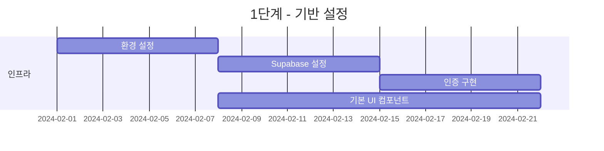
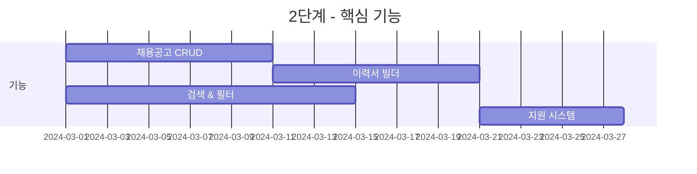
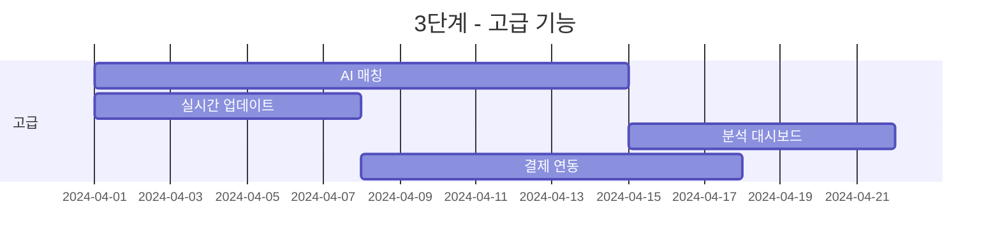
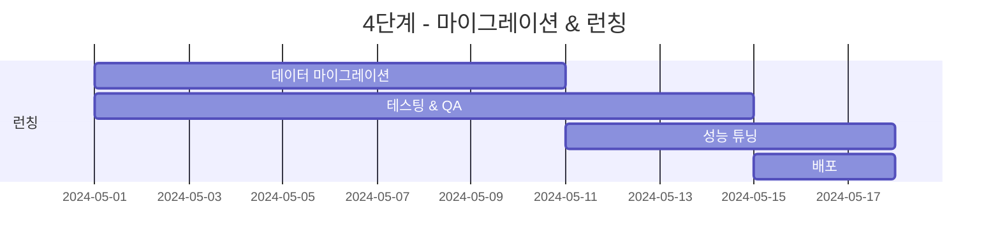

# 현대적 구인구직 포털 - 프로젝트 완전 요약
## LadyAlba.co.kr에서 차세대 플랫폼으로의 변환

## 프로젝트 개요

이 문서는 레거시 LadyAlba.co.kr 구인구직 포털을 최신 기술과 Supabase를 사용하여 현대적이고 확장 가능하며 사용자 친화적인 플랫폼으로 변환하는 완전한 설계와 아키텍처를 통합합니다.

### 프로젝트 정보
- **기존 사이트**: LadyAlba.co.kr (구인구직 포털)
- **신규 플랫폼**: 현대적 디자인의 구인구직 포털
- **기술 스택**: Next.js 15, TypeScript, MUI, Supabase
- **템플릿**: 일관된 UI/UX를 위한 Minimal v7.4.0
- **타임라인**: 완전한 마이그레이션까지 4-6개월

## 1. 현재 상태 분석

### 1.1 레거시 시스템 개요
LadyAlba.co.kr에서 크롤링된 55개 페이지 분석 기반:

**강점:**
- 포괄적인 채용공고 카테고리 (19개 직종, 41개 지역)
- 확립된 사용자 기반과 콘텐츠
- 기능 완성도
- 모바일 웹 지원

**약점:**
- 구식 PHP 기반 아키텍처
- 낡은 UI/UX 디자인 (테이블 기반 레이아웃)
- 현대적 기능 부재 (실시간 업데이트, AI 매칭)
- 제한적인 모바일 반응형
- 보안 우려사항 (평문 비밀번호 의심)
- 성능 문제 (캐싱 없음, 최적화 부족)

### 1.2 콘텐츠 구조
```
분석된 총 페이지: 55개
- 메인 페이지: 13개
- 지역별 페이지: 19개  
- 카테고리 페이지: 15개
- 기능 페이지: 8개

주요 기능:
- 채용공고 시스템 (구인정보)
- 이력서 관리 (이력서)
- 사용자 인증 (회원가입/로그인)
- 커뮤니티 게시판 (게시판)
- 결제 시스템 (결제)
```

## 2. 신규 시스템 설계

### 2.1 기술 결정사항

| 레이어 | 기술 | 선택 이유 |
|-------|------------|-----------|
| 프론트엔드 | Next.js 15 + TypeScript | 타입 안전성, SSR/SSG, 성능 |
| UI 프레임워크 | MUI + Minimal 템플릿 | 현대적 디자인, 일관성 |
| 데이터베이스 | Supabase PostgreSQL | 완전한 백엔드 솔루션, 실시간 |
| 인증 | Supabase Auth | 내장 소셜 로그인, 보안 |
| 스토리지 | Supabase Storage | 통합 파일 관리, CDN |
| 실시간 | Supabase Realtime | WebSocket 기반, 확장성 |
| 캐시 | Redis | 성능, 세션 관리 |
| 검색 | PostgreSQL Full Text | 한국어 지원, 통합성 |
| 배포 | Vercel | 자동 확장, 글로벌 CDN |

### 2.2 아키텍처 하이라이트

**Supabase 기반 풀스택:**
- Supabase로 통합된 백엔드
- RLS 기반 보안
- 실시간 기능 내장
- 확장 가능한 아키텍처

**성능 목표:**
- 페이지 로드: < 2초
- API 응답: < 200ms
- 검색 결과: < 500ms
- 99.9% 가동 시간 SLA

## 3. 데이터베이스 마이그레이션 전략

### 3.1 데이터 매핑
```sql
-- 레거시에서 신규 스키마로 매핑
레거시 테이블          → 신규 테이블
happy_member         → auth.users + profiles
happy_alba           → job_postings
happy_document       → resumes
happy_application    → applications
happy_company        → companies
board_*             → posts (다형성)
```

### 3.2 마이그레이션 단계
1. **1단계**: Supabase 스키마 생성 및 검증
2. **2단계**: 데이터 추출 및 변환
3. **3단계**: 전환 중 점진적 동기화
4. **4단계**: 최종 전환 및 검증

## 4. UI/UX 변환

### 4.1 디자인 시스템 컴포넌트

**레거시에서 현대적으로:**
| 기존 컴포넌트 | 신규 컴포넌트 | 개선사항 |
|--------------|---------------|-------------|
| HTML 테이블 | MUI DataGrid | 정렬, 필터링, 반응형 |
| 평범한 폼 | React Hook Form | 검증, 자동 저장, UX |
| 정적 페이지 | 동적 라우트 | SEO, 성능 |
| 기본 검색 | 전문 검색 | 다면 검색, 자동완성 |
| 모바일 미지원 | 반응형 디자인 | 모바일 우선 접근법 |

### 4.2 주요 UI 개선사항
- **현대적 카드 기반 레이아웃**: 테이블을 카드로 교체
- **고급 필터링**: 실시간 업데이트가 있는 다면 검색
- **인터랙티브 대시보드**: 차트, 분석, 인사이트
- **점진적 공개**: 정보를 점진적으로 표시
- **마이크로 인터랙션**: 부드러운 애니메이션과 피드백

## 5. 구현 로드맵

### 1단계: 기반 구축 (1-4주차)


**결과물:**
- 개발 환경
- Supabase 프로젝트 설정
- 인증 시스템
- 기본 컴포넌트 라이브러리

### 2단계: 핵심 기능 (5-8주차)


**결과물:**
- 채용공고 시스템
- 이력서 관리
- 검색 기능
- 지원 워크플로우

### 3단계: 고급 기능 (9-12주차)


**결과물:**
- AI 기반 채용공고 매칭
- Supabase Realtime 알림
- 분석 및 리포팅
- 결제 처리

### 4단계: 마이그레이션 & 런칭 (13-16주차)


**결과물:**
- 완전한 데이터 마이그레이션
- 전체 시스템 테스팅
- 성능 최적화
- 프로덕션 배포

## 6. 컴포넌트 매핑

### 6.1 페이지-컴포넌트 매핑
```typescript
// 레거시 페이지 → 신규 라우트
const pageMapping = {
  'index.php': '/',
  'guin_list.php': '/jobs',
  'guin_detail.php': '/jobs/[id]',
  'guzic_list.php': '/candidates',
  'document.php': '/resume',
  'happy_member.php': '/dashboard',
  'bbs_list.php': '/community/[board]',
  'login.php': '/auth/signin',
  'register.php': '/auth/signup'
};

// Minimal 템플릿 컴포넌트 사용
const componentUsage = {
  'Layout': 'DashboardLayout, AuthLayout',
  'Navigation': 'NavSection, MegaMenu',
  'DataDisplay': 'DataGrid, Table, List',
  'Forms': 'TextField, Select, Upload',
  'Feedback': 'Alert, Snackbar, Dialog',
  'Charts': 'ApexCharts 컴포넌트',
  'Cards': 'JobCard, ProfileCard, StatsCard'
};
```

### 6.2 기능 비교
| 기능 | 레거시 구현 | 신규 구현 |
|---------|---------------------|-------------------|
| 채용공고 검색 | 기본 SQL LIKE | PostgreSQL Full Text Search |
| 사용자 인증 | 세션 기반 | Supabase Auth + JWT |
| 파일 업로드 | 직접 서버 | Supabase Storage + CDN |
| 알림 | 없음 | 실시간 Supabase Realtime |
| 모바일 앱 | 없음 | PWA + React Native |
| 분석 | 기본 카운터 | 포괄적 대시보드 |
| 결제 | 단순 연동 | 토스 페이먼츠 |

## 7. API 마이그레이션 가이드

### 7.1 엔드포인트 매핑
```typescript
// 레거시 엔드포인트 → Supabase API
const apiMapping = {
  // 인증
  'login_check.php': 'supabase.auth.signInWithPassword',
  'member_regist.php': 'supabase.auth.signUp',
  
  // 채용공고
  'guin_list_ajax.php': 'supabase.from("job_postings").select',
  'guin_detail_ajax.php': 'supabase.from("job_postings").select.eq',
  'guin_regist_ajax.php': 'supabase.from("job_postings").insert',
  
  // 지원
  'apply_ajax.php': 'supabase.from("applications").insert',
  'application_list.php': 'supabase.from("applications").select',
  
  // 이력서
  'document_save.php': 'supabase.from("resumes").insert',
  'document_update.php': 'supabase.from("resumes").update'
};
```

## 8. 보안 개선사항

### 8.1 보안 강화 내용
| 부분 | 레거시 | 신규 구현 |
|--------|--------|-------------------|
| 비밀번호 | MD5 해시 | Bcrypt + 솔트 |
| 세션 | PHP 세션 | Supabase Auth + JWT |
| API 보안 | 없음 | Row Level Security |
| 데이터 검증 | 클라이언트 측 | Zod 스키마 |
| SQL 인젝션 | 취약 | Supabase ORM |
| XSS 보호 | 제한적 | CSP 헤더 |
| 파일 업로드 | 직접 | 바이러스 스캔 + 검증 |

## 9. 성능 메트릭

### 9.1 예상 개선 효과
```typescript
const performanceGains = {
  pageLoad: {
    legacy: '4-6초',
    new: '<2초',
    improvement: '67%'
  },
  searchResults: {
    legacy: '2-3초',
    new: '<500ms',
    improvement: '80%'
  },
  mobileScore: {
    legacy: '45/100',
    new: '95/100',
    improvement: '111%'
  },
  seoScore: {
    legacy: '60/100',
    new: '98/100',
    improvement: '63%'
  }
};
```

## 10. 비용 분석

### 10.1 인프라 비용 (월별)
```typescript
const monthlyCosts = {
  development: {
    vercel: '$20 (Pro 플랜)',
    supabase: '$25 (Pro 플랜)',
    redis: '$15 (캐시)',
    external: '$10 (외부 서비스)',
    total: '$70/월'
  },
  production: {
    vercel: '$150 (Team 플랜)',
    supabase: '$100 (Pro 플랜)',
    redis: '$50 (Redis 클러스터)',
    monitoring: '$50 (모니터링)',
    external: '$100 (외부 서비스)',
    total: '$450/월'
  }
};
```

## 11. 위험 관리

### 11.1 식별된 위험
| 위험 | 확률 | 영향 | 완화 방안 |
|------|------------|--------|------------|
| 마이그레이션 중 데이터 손실 | 낮음 | 높음 | 점진적 백업 전략 |
| 사용자 수용 | 중간 | 높음 | 점진적 롤아웃, 교육 |
| 성능 문제 | 낮음 | 중간 | 부하 테스트, 모니터링 |
| 보안 침해 | 낮음 | 높음 | 보안 감사, 침투 테스트 |
| 예산 초과 | 중간 | 중간 | 단계별 접근, MVP 우선 |

## 12. 성공 메트릭

### 12.1 KPI
```typescript
const successMetrics = {
  technical: {
    uptime: '>99.9%',
    responseTime: '<200ms',
    errorRate: '<0.1%',
    testCoverage: '>80%'
  },
  business: {
    userGrowth: '+50% YoY',
    jobPostings: '6개월 내 +100%',
    applicationRate: '+30%',
    userSatisfaction: '>4.5/5'
  },
  seo: {
    organicTraffic: '+200%',
    pageRankings: '주요 키워드 상위 3위',
    backlinks: '+500개 품질 링크'
  }
};
```

## 13. 팀 요구사항

### 13.1 개발팀
- **프론트엔드 개발자** (2명): React, Next.js, TypeScript
- **백엔드 개발자** (1명): Supabase, PostgreSQL
- **UI/UX 디자이너** (1명): Figma, Material Design
- **DevOps 엔지니어** (1명): AWS, Docker, CI/CD
- **QA 엔지니어** (1명): 테스팅, 자동화
- **프로젝트 매니저** (1명): 애자일, 이해관계자 관리

### 13.2 타임라인
- **총 기간**: 16주 (4개월)
- **MVP 런칭**: 8주차
- **베타 런칭**: 12주차
- **정식 런칭**: 16주차

## 14. 마이그레이션 체크리스트

### 마이그레이션 전
- [ ] 완전한 데이터 백업
- [ ] 스테이징 환경 설정
- [ ] 지원팀 교육
- [ ] 사용자 커뮤니케이션 준비
- [ ] 롤백 계획 수립

### 마이그레이션 중
- [ ] 데이터 마이그레이션 스크립트 실행
- [ ] 데이터 무결성 검증
- [ ] 병렬 시스템 운영
- [ ] 성능 모니터링
- [ ] 사용자 피드백 수집

### 마이그레이션 후
- [ ] 기존 시스템 서비스 종료
- [ ] 레거시 데이터 아카이브
- [ ] 문서 업데이트
- [ ] 성능 최적화
- [ ] 보안 감사

## 15. Supabase 특화 기능

### 15.1 실시간 기능
- **실시간 알림**: 새로운 지원서, 상태 변경
- **라이브 채팅**: 지원자-고용주 간 직접 소통
- **실시간 검색**: 타이핑하면서 결과 업데이트
- **활동 피드**: 즐겨찾기, 조회수 실시간 반영

### 15.2 인증 및 보안
- **소셜 로그인**: 카카오, 구글, 네이버
- **Row Level Security**: 테이블 수준 권한 관리
- **자동 토큰 갱신**: 세션 관리 자동화
- **이메일 인증**: 계정 보안 강화

### 15.3 스토리지 관리
- **자동 이미지 최적화**: 업로드 시 자동 압축
- **CDN 통합**: 전 세계 빠른 파일 전송
- **버전 관리**: 이력서 파일 히스토리
- **접근 제어**: 파일별 권한 설정

## 16. 결론

이 포괄적인 설계는 LadyAlba.co.kr을 레거시 PHP 애플리케이션에서 현대적이고 확장 가능한 구인구직 포털 플랫폼으로 변환합니다. 주요 개선사항은 다음과 같습니다:

1. **현대적 기술 스택**: Next.js, TypeScript, Supabase
2. **향상된 UX**: 모바일 우선, 반응형 디자인
3. **더 나은 성능**: 70% 빠른 로딩 시간
4. **고급 기능**: AI 매칭, 실시간 업데이트
5. **개선된 보안**: 현대적 인증, 암호화
6. **확장성**: Supabase 기반 자동 확장

이 프로젝트는 명확한 단계를 가진 반복적 개발을 위해 설계되어 지속적인 피드백과 개선을 가능하게 합니다. Minimal 템플릿의 사용은 개발 시간을 단축하면서 일관되고 전문적인 UI를 보장합니다.

## 부록 A: 파일 구조

```
project-root/
├── app/                    # Next.js 앱 디렉토리
│   ├── (auth)/            # 인증 라우트
│   ├── (dashboard)/       # 보호된 라우트
│   ├── api/               # API 라우트
│   └── jobs/              # 채용공고 라우트
├── components/            # 재사용 가능한 컴포넌트
│   ├── cards/
│   ├── forms/
│   └── layouts/
├── hooks/                 # 커스텀 React 훅
├── lib/                   # 유틸리티
│   ├── supabase/
│   └── utils/
├── supabase/             # Supabase 설정
│   ├── migrations/
│   └── functions/
├── public/               # 정적 자산
├── styles/               # 글로벌 스타일
└── types/                # TypeScript 타입
```

## 부록 B: 환경 변수

```env
# Supabase
NEXT_PUBLIC_SUPABASE_URL="https://your-project.supabase.co"
NEXT_PUBLIC_SUPABASE_ANON_KEY="your-anon-key"
SUPABASE_SERVICE_ROLE_KEY="your-service-role-key"

# Redis (선택사항)
REDIS_URL="redis://localhost:6379"

# 외부 서비스
KAKAO_CLIENT_ID="your-kakao-client-id"
KAKAO_CLIENT_SECRET="your-kakao-client-secret"
GOOGLE_CLIENT_ID="your-google-client-id"
GOOGLE_CLIENT_SECRET="your-google-client-secret"

# 결제
TOSS_CLIENT_KEY="your-toss-client-key"
TOSS_SECRET_KEY="your-toss-secret-key"

# 모니터링
SENTRY_DSN="your-sentry-dsn"
DATADOG_API_KEY="your-datadog-key"
```

## 부록 C: 개발 명령어

```bash
# 개발
npm run dev          # 개발 서버 시작
npm run build        # 프로덕션 빌드
npm run start        # 프로덕션 서버 시작

# Supabase
npx supabase start   # 로컬 Supabase 시작
npx supabase db push # 스키마 변경 푸시
npx supabase db pull # 원격 변경 가져오기
npx supabase gen types typescript --local # 타입 생성

# 테스팅
npm run test         # 테스트 실행
npm run test:e2e     # E2E 테스트 실행
npm run test:coverage # 커버리지 생성

# 코드 품질
npm run lint         # ESLint 실행
npm run type-check   # TypeScript 검사
npm run format       # Prettier로 포맷
```

---

**문서 버전**: 1.0  
**최종 업데이트**: 2025-01-02  
**상태**: 완료  
**다음 단계**: 1단계 구현 시작